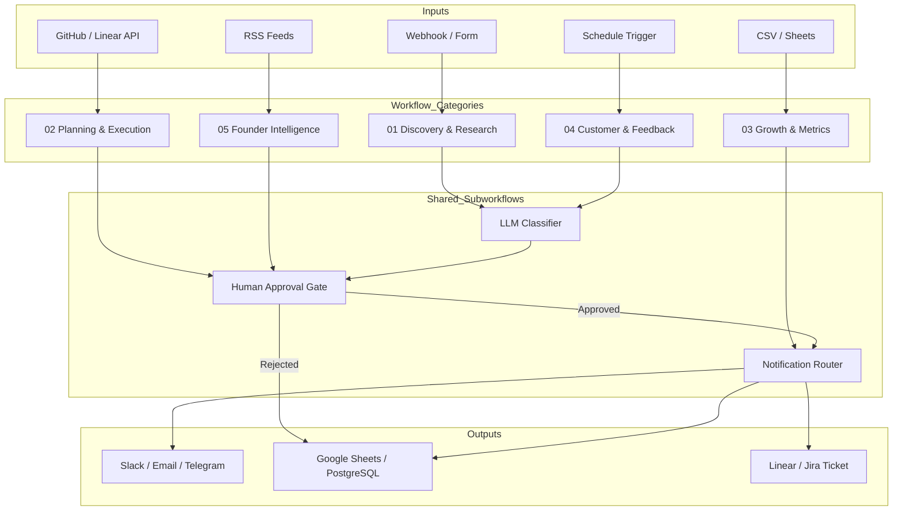

# Product & Founder Automation OS

> ⚠️ **This project has zero affiliation with n8n GmbH.** It is fully independent, 100% open-source, and non-profit. No sponsorship, no endorsement, no commercial relationship — just workflows built by practitioners for practitioners.

<div align="center">

**50 production-ready n8n workflows for product managers, founders, and small teams.**
*Stop building systems. Start shipping product.*

[](LICENSE)
[](https://n8n.io)
[](#workflows)
[](CONTRIBUTING.md)
[](https://arthurkerimov.com)

</div>

---

## What this is

**Product & Founder Automation OS** is an open-source collection of 50 complete, importable [n8n](https://n8n.io) workflows built for the people who run products and build companies.

Every workflow solves a real, repeated problem — the kind that costs founders and PMs hours every week. They're designed to be **imported in minutes, not configured for days**.

---

## The problems this solves

| Without automation | With this OS |
|---|---|
| Feedback scattered across Intercom, Slack, App Store, and surveys | One weekly AI-synthesised insight report |
| Competitor pricing changed — you found out from a customer | Automated diff → alert within hours |
| Friday stand-up prep takes 2 hours | Weekly product brief generated in minutes |
| Investor updates written from scratch every month | AI drafts it from your Sheets data |
| Board deck data collected manually the night before | Auto-assembled 10 days before every meeting |
| AI outputs trusted blindly | Every AI conclusion shows confidence + source evidence |
| Approvals skipped because it's "just a notification" | Human-in-the-loop gate before any external action |

---

## 50 Workflows

### 01 — Discovery & Research

| # | Workflow | What it does |
|---|---|---|
| 04 | User Interview Processor | Turns transcripts into structured problems, quotes, and segments |
| 05 | Research Repository Updater | Normalises interviews, surveys, and notes into a tagged repository |
| 06 | Feature Request Analyzer | Deduplicates requests, estimates frequency, maps to problems |
| 07 | Survey Response Analyzer | Pattern-finds across quant + qual, compares segments |
| 08 | Review & Community Monitor | Scans App Store, G2, Reddit, Hacker News daily for signals |
| 09 | Product Opportunity Miner | Surfaces underserved problems from aggregated research |
| 10 | Research Recruitment Manager | Manages participant sourcing, scheduling, and follow-up |

### 02 — Planning & Execution

| # | Workflow | What it does |
|---|---|---|
| 11 | Roadmap Prioritization Engine | RICE scoring on feature candidates from a Sheet |
| 12 | Sprint Planning Assistant | Capacity-aware sprint loader with team velocity tracking |
| 13 | PRD Auto-Drafter | Generates structured PRD from a brief → human review gate |
| 14 | OKR Progress Tracker | Weekly OKR health email with RAG status |
| 15 | Stakeholder Update Generator | Turns Jira/Linear progress into stakeholder digest |
| 16 | Meeting to Action Converter | Transcript → decisions + owners + deadlines |
| 17 | Risk & Dependency Tracker | Weekly risk register with severity scoring |
| 18 | Launch Checklist Automator | Pre-launch gate with parallel track verification |
| 19 | Decision Log Keeper | Captures decisions with context and rationale |
| 20 | Retrospective Insight Extractor | Sprint retro → themes + action items |

### 03 — Growth & Metrics

| # | Workflow | What it does |
|---|---|---|
| 21 | Metrics Dashboard Mailer | Weekly KPI email with trend arrows |
| 22 | Revenue Health Monitor | MRR / ARR / churn vs target with alerts |
| 23 | Conversion Funnel Analyzer | Step-by-step CR with biggest drop-off highlighted |
| 24 | Cohort Churn Detector | Ranks cohorts by 30 / 90-day churn |
| 25 | NPS Pulse Tracker | Live score tracking with segment breakdown |
| 26 | A/B Test Result Evaluator | Two-proportion z-test → SHIP / CONTINUE / STOP decision |
| 27 | Usage Anomaly Detector | Z-score vs 14-day rolling baseline — no threshold tuning needed |
| 28 | Growth Experiment Logger | Logs experiments; Sunday win-rate digest |
| 29 | Activation Rate Monitor | 7 / 14 / 30-day cohort activation triage |
| 30 | Pricing Signal Collector | AI synthesis of WTP signals from research + competitor data |

### 04 — Customer & Feedback

| # | Workflow | What it does |
|---|---|---|
| 31 | Support Ticket Classifier | Tags, prioritises, and routes tickets by type + severity |
| 32 | Churn Reason Analyzer | Clusters exit survey responses into loss themes |
| 33 | Customer Health Scorer | 5-signal health score with triage routing |
| 34 | Voice of Customer Aggregator | Weekly VoC digest from all feedback sources |
| 35 | Onboarding Drop-off Detector | Flags users stuck at each activation step |
| 36 | Customer Win-Loss Analyzer | Patterns wins and losses into strategic insight |
| 37 | Feedback to Feature Bridge | Maps raw feedback to roadmap candidates |
| 38 | NPS Follow-up Automator | Routes promoters to referral flow, detractors to recovery |
| 39 | Renewal Risk Alerter | Flags accounts approaching renewal with risk score |
| 40 | Customer Case Study Miner | Finds ideal case study candidates → human approval gate |

### 05 — Founder Intelligence

| # | Workflow | What it does |
|---|---|---|
| 41 | Market Signal Radar | Weekly AI synthesis of market signals from curated RSS feeds |
| 42 | Founder Daily Brief | Weekday 07:00 email: metrics + blockers + decision of the day |
| 43 | Investor Update Composer | AI drafts monthly investor email → founder review gate |
| 44 | Hiring Signal Tracker | Competitor job listings → strategic intent analysis |
| 45 | Team Sentiment Monitor | Anonymous weekly pulse with threshold alert |
| 46 | Burn Rate Runway Tracker | Monthly burn, runway, default rate with runway alert |
| 47 | Competitive Pricing Scanner | Detects competitor price changes from historical snapshots |
| 48 | Press Mention Aggregator | Brand + competitor monitoring with sentiment classification |
| 49 | Product News Digest | Monday curation of 5-7 top product stories with PM insight |
| 50 | Board Deck Data Collector | Auto-assembles board brief with data gaps + prep checklist |

---

## Quick Start

### Option A — n8n Cloud (fastest)

1. Sign in to [app.n8n.cloud](https://app.n8n.cloud)
2. Open any workflow folder → copy `workflow.json`
3. In n8n: **Workflows → Import from clipboard**
4. Follow the setup steps in the workflow's `README.md`

### Option B — Self-hosted (Docker)

```bash
# Clone
git clone https://github.com/aalkerimov/product-manager-n8n-automation
cd product-manager-n8n-automation

# Configure
cp .env.example .env
# Edit .env with your values

# Start n8n
docker compose up -d

# Open in browser
open http://localhost:5678
```

Then import any `workflow.json` via **Workflows → ⋮ → Import from file**.

### Option C — Existing n8n instance

Drop any `workflow.json` straight into your n8n via the **Import from file** option.

---

## Stack

### Minimum (no paid infra)

| Layer | Tool |
|---|---|
| Orchestration | n8n (self-hosted or Cloud) |
| Storage | Google Sheets |
| Notifications | SMTP Email |
| AI | OpenAI gpt-4o-mini (~$0.01–0.10/run) |

### Recommended (full stack)

| Layer | Tool |
|---|---|
| Storage | PostgreSQL |
| Notifications | Slack |
| Issue tracking | Linear or Jira |
| Code context | GitHub API |
| AI | Any OpenAI-compatible provider |

---

## Architecture



---

## Per-workflow file structure

Every workflow ships with 7 files so you can import, test, and customise with confidence:

```
<id>-<workflow-name>/
├── workflow.json          # Import directly into n8n
├── README.md              # Setup guide, env vars, expected behaviour
├── config.example.json    # All environment variables documented
├── sample-input.json      # Test payload to trigger manually
├── sample-output.json     # What a successful run produces
├── CHANGELOG.md           # Version history
└── tests/
    ├── fixtures/
    └── expected-output/
```

---

## Design principles

1. **Useful before impressive** — every workflow solves a real repeated problem
2. **Modular over duplicated** — shared subworkflows for AI, approvals, and notifications
3. **Human approval for consequential actions** — no tickets, messages, or outbound emails without a gate
4. **Transparent AI** — every AI conclusion shows confidence score + source evidence
5. **Easy to import and test** — sample data included, no paid infra required to start

---

## Privacy and data handling

- No customer data leaves your n8n instance without your explicit configuration
- All AI calls go to the provider you set — n8n does not proxy them
- Competitor URLs and pricing snapshots stay in your own storage
- See [SECURITY.md](SECURITY.md) for credential and secret guidance

---

## About the author

This project was built by **[Arthur Kerimov](https://arthurkerimov.com)** — AI Product Leader & Founder.

**Connect:**
- 🌐 [arthurkerimov.com](https://arthurkerimov.com)
- 💼 [linkedin.com/in/aalkerimov](https://www.linkedin.com/in/aalkerimov/)
- 🐦 [@aalkerimov](https://x.com/aalkerimov)
- ✈️ [Telegram @kerimoff_artur](https://t.me/kerimoff_artur)

---

## Contributing

See [CONTRIBUTING.md](CONTRIBUTING.md) for the workflow submission process, naming conventions, and PR checklist.

---

## License

MIT — see [LICENSE](LICENSE).

---

## ⚠️ Disclaimer

**This project is completely independent and non-profit.**

- 🚫 **No affiliation** with [n8n GmbH](https://n8n.io) — not sponsored, not endorsed, not officially supported by them in any way
- 🔓 **Fully open-source** under the MIT licence — fork it, extend it, redistribute it freely
- 💸 **Non-profit** — built by a practitioner to solve real problems, not to sell anything
- 🏷️ "n8n" is a trademark of n8n GmbH — used here purely as a descriptive term for the automation platform this project runs on
