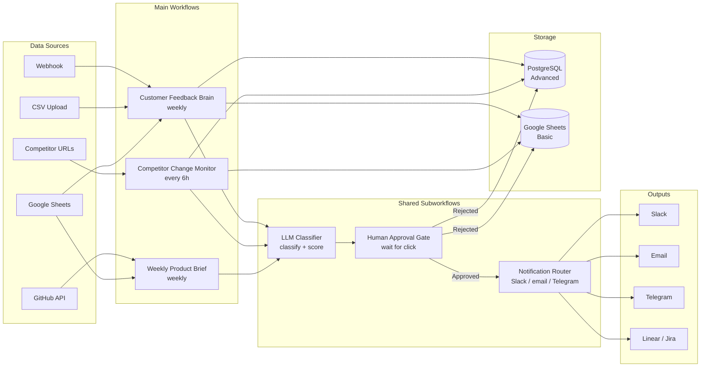
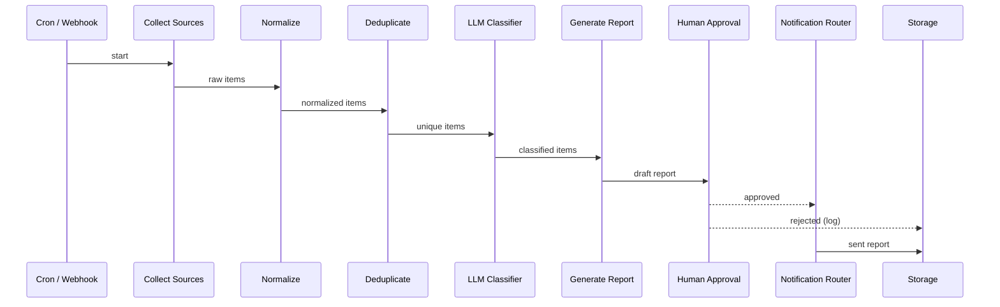

# Architecture

This document explains how the workflows and subworkflows fit together.

---

## Overview

The **Product & Founder Automation OS** is not a single monolithic workflow.
It is a collection of focused, modular workflows that share common subworkflows
for classification, approvals, and notifications.



---

## Workflow responsibilities

### Customer Feedback Brain

Collects raw feedback from multiple sources, normalises it to a single schema,
deduplicates, classifies each item by problem, sentiment, urgency, segment, and
product area, then generates a weekly product-insights report.

**Key design decisions:**
- Deduplication uses a hash of normalised text + source + date window
- Classification is done in batches of 10 to reduce AI cost
- The report is generated by a single structured prompt with all classified items
- Human approval is required before the report is sent externally

### Competitor Change Monitor

Checks a configured list of competitor pages on a schedule, stores snapshots,
computes a text diff, sends the diff through the LLM Classifier to score
importance and draft a product response, then notifies the team.

**Key design decisions:**
- Snapshots stored as plain text (HTML stripped) to reduce storage cost
- A minimum diff length of 100 chars filters out minor changes (configurable)
- Importance scoring 1–10: only scores ≥ 6 trigger notifications (configurable)
- Rate-limited to one URL check per 2 seconds to avoid IP blocks

### Weekly Product Brief

Aggregates data from GitHub (commits, PRs), Google Sheets (metrics, blockers),
and the feedback brain's output, then generates a structured weekly digest.

**Key design decisions:**
- GitHub data is read-only — no writes to the repo
- All data collection happens before the AI call to minimise latency
- The brief template is configurable via environment variables
- Supports a "manual data" mode where you paste metrics into a Sheets row

---

## Subworkflow contracts

### LLM Classifier

**Input:**
```json
{
  "mode": "feedback | competitor | brief",
  "items": [{ "id": "string", "text": "string", "metadata": {} }]
}
```

**Output:**
```json
{
  "results": [{
    "id": "string",
    "classification": {},
    "confidence": 0.85,
    "reasoning": "string"
  }]
}
```

### Human Approval Gate

**Input:**
```json
{
  "title": "string",
  "summary": "string",
  "details": {},
  "approver_email": "string",
  "timeout_hours": 24
}
```

**Output:**
```json
{
  "decision": "approved | rejected | timeout",
  "decided_at": "ISO8601",
  "comment": "string"
}
```

### Notification Router

**Input:**
```json
{
  "channel": "slack | email | telegram | all",
  "title": "string",
  "body": "string",
  "urgency": "low | medium | high",
  "metadata": {}
}
```

**Output:** `{ "sent": true, "channels": ["slack"] }`

---

## Data flow: Customer Feedback Brain



---

## Error handling strategy

Every HTTP call has:
- **3 retries** with exponential back-off (1 s, 2 s, 4 s)
- **Error branch** that logs to storage and sends a low-priority alert
- **Timeout** of 30 seconds per request

AI calls have:
- **Fallback** to a simpler prompt if the full prompt exceeds token limits
- **Temperature 0.3** for consistent, reproducible outputs
- **Structured JSON output** requested via system prompt to reduce parsing errors

---

## Privacy model

| Data type | Where it lives | Who can see it |
|---|---|---|
| Raw feedback | Your n8n DB / Sheets | n8n instance users |
| AI classifications | Your n8n DB / Sheets | n8n instance users |
| Competitor snapshots | Your n8n DB / Sheets | n8n instance users |
| AI prompts | Sent to AI provider | n8n + AI provider |
| Reports / briefs | Sent to configured channels | Recipients you configure |

No data is sent to any third party other than:
1. The AI provider you configure (OpenAI or compatible)
2. The notification channel you configure (Slack, email, etc.)
3. The issue tracker you configure (Linear, Jira) — only if a ticket is created
